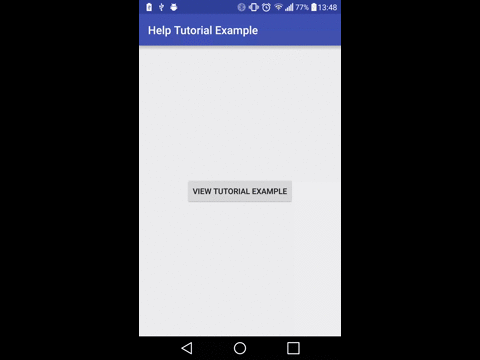

# MaterialIntroTutorial
Android Library demonstrating a material intro tutorial much like the ones on Google Sheets

This library shows a help or introduction tutorial into your application. Its inspired by the one in the Google Sheets Android app. 
The help tutorial takes the background colour set for each page and when scrolling between the two pages, the two colours will fade into one another.

[  ](https://bintray.com/spongebobrf/maven/MaterialIntroTutorial/_latestVersion)

# Example Usage

Add the following into your build.gradle:
```groovy
        compile 'za.co.riggaroo:materialhelptutorial:1.0.0'
```
In your activity, create a list of TutorialItems (set the title, subtitle, background colour and image drawable int). Pass them onto the MaterialTutorialActivity and start the activity for result.
```android
    public void loadTutorial() {
        Intent mainAct = new Intent(this, MaterialTutorialActivity.class);
        mainAct.putParcelableArrayListExtra(MaterialTutorialActivity.MATERIAL_TUTORIAL_ARG_TUTORIAL_ITEMS, getTutorialItems(this));
        startActivityForResult(mainAct, REQUEST_CODE);

    }

    private ArrayList<TutorialItem> getTutorialItems(Context context) {
        TutorialItem tutorialItem1 = new TutorialItem(context.getString(R.string.slide_1_african_story_books), context.getString(R.string.slide_1_african_story_books_subtitle),
                R.color.slide_1, R.drawable.tut_page_1_front,  R.drawable.tut_page_1_background);

        ...

        ArrayList<TutorialItem> tutorialItems = new ArrayList<>();
        tutorialItems.add(tutorialItem1);
        ...

        return tutorialItems;
    }
```
You should see a tutorial like below:


This library is using the following:
- CirclePageIndicator
- Glide for image loading
- Percent Support Library


# License 

Copyright (c) 2015 Rebecca Franks

Permission is hereby granted, free of charge, to any person obtaining a copy
of this software and associated documentation files (the "Software"), to deal
in the Software without restriction, including without limitation the rights
to use, copy, modify, merge, publish, distribute, sublicense, and/or sell
copies of the Software, and to permit persons to whom the Software is
furnished to do so, subject to the following conditions:


The above copyright notice and this permission notice shall be included in
all copies or substantial portions of the Software.


THE SOFTWARE IS PROVIDED "AS IS", WITHOUT WARRANTY OF ANY KIND, EXPRESS OR
IMPLIED, INCLUDING BUT NOT LIMITED TO THE WARRANTIES OF MERCHANTABILITY,
FITNESS FOR A PARTICULAR PURPOSE AND NONINFRINGEMENT.  IN NO EVENT SHALL THE
AUTHORS OR COPYRIGHT HOLDERS BE LIABLE FOR ANY CLAIM, DAMAGES OR OTHER
LIABILITY, WHETHER IN AN ACTION OF CONTRACT, TORT OR OTHERWISE, ARISING FROM,
OUT OF OR IN CONNECTION WITH THE SOFTWARE OR THE USE OR OTHER DEALINGS IN
THE SOFTWARE.


